# 📚 Documentación Completa del Proyecto AWS Microtasks Platform

> **Plataforma de crowdsourcing para micro-tareas construida con servicios de AWS**

---

## 📋 Tabla de Contenidos

1. [Descripción General](#descripción-general)
2. [Arquitectura del Sistema](#arquitectura-del-sistema)
3. [Estructura del Proyecto](#estructura-del-proyecto)
4. [Base de Datos (DynamoDB)](#base-de-datos-dynamodb)
5. [Modelos de Datos](#modelos-de-datos)
6. [API Endpoints](#api-endpoints)
7. [Servicios AWS Utilizados](#servicios-aws-utilizados)
8. [Frontend (React + TypeScript)](#frontend-react--typescript)
9. [Backend (Lambda Handlers)](#backend-lambda-handlers)
10. [Flujos de Trabajo](#flujos-de-trabajo)
11. [Sistema de Gamificación](#sistema-de-gamificación)
12. [Sistema de Control de Calidad (QC)](#sistema-de-control-de-calidad-qc)
13. [Sistema de Pagos](#sistema-de-pagos)
14. [Sistema de Disputas](#sistema-de-disputas)
15. [Relaciones entre Entidades](#relaciones-entre-entidades)
16. [Diagramas de Flujo](#diagramas-de-flujo)
17. [Configuración y Variables de Entorno](#configuración-y-variables-de-entorno)

---

## Descripción General

**AWS Microtasks Platform** es una plataforma de crowdsourcing que permite a:

| Rol | Descripción |
|-----|-------------|
| **Requesters** (Solicitantes) | Crear y publicar micro-tareas con soporte multimedia |
| **Workers** (Trabajadores) | Completar tareas y recibir pagos |
| **Admins** (Administradores) | Gestionar disputas y monitorear la plataforma |

### Tipos de Tareas Soportadas

- 🖼️ **Clasificación de Imágenes** (`image-classification`)
- 📦 **Bounding Box** (`bounding-box`) - Dibujar rectángulos en imágenes
- 🎤 **Transcripción de Audio** (`audio-transcription`)
- 💭 **Etiquetado de Sentimiento** (`sentiment-labeling`)
- ✅ **Validación de Datos** (`data-validation`)

---

## Arquitectura del Sistema

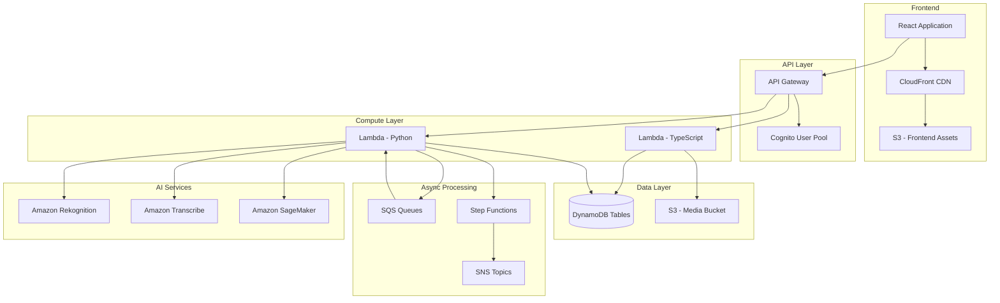

---

## Estructura del Proyecto

```
aws-microtasks-platform/
├── 📁 backend/                    # Código del backend
│   ├── package.json               # Dependencias Node.js
│   ├── requirements.txt           # Dependencias Python
│   └── src/
│       ├── handlers/              # Lambda handlers (Python)
│       │   ├── disputes/          # Gestión de disputas
│       │   ├── payments/          # Procesamiento de pagos
│       │   ├── qc/                # Control de calidad & validación IA
│       │   ├── submissions/       # Manejo de submissions
│       │   ├── tasks/             # CRUD de tareas
│       │   ├── wallet/            # Billetera & transacciones
│       │   └── workers/           # Gamificación de workers
│       ├── shared/                # Módulos compartidos Python
│       │   ├── config.py          # Configuración de entorno
│       │   ├── models.py          # Modelos de datos
│       │   ├── auth.py            # Utilidades de autenticación
│       │   ├── dynamo.py          # Helpers de DynamoDB
│       │   ├── ai_services.py     # Integraciones AWS AI
│       │   ├── gamification.py    # Lógica de gamificación
│       │   ├── fraud_detection.py # Detección de fraude
│       │   ├── s3_utils.py        # Utilidades S3
│       │   ├── sqs.py             # Utilidades SQS
│       │   └── utils.py           # Utilidades comunes
│       ├── tasks/                 # Lambda handlers (TypeScript)
│       ├── media/                 # Handlers de upload multimedia
│       └── submissions/           # Handlers de submissions
│
├── 📁 frontend/                   # Aplicación React
│   ├── index.html                 # Punto de entrada HTML
│   ├── package.json               # Dependencias npm
│   ├── vite.config.ts             # Configuración Vite
│   └── src/
│       ├── App.tsx                # Componente raíz con rutas
│       ├── aws-config.ts          # Configuración AWS Amplify
│       ├── main.tsx               # Punto de entrada React
│       ├── components/            # Componentes reutilizables
│       │   ├── BoundingBoxEditor.tsx    # Editor de bounding boxes
│       │   ├── DashboardMetrics.tsx     # Métricas de dashboard
│       │   └── TaskMedia.tsx            # Visualización multimedia
│       ├── pages/                 # Páginas de la aplicación
│       │   ├── AdminDashboard.tsx       # Dashboard de admin
│       │   ├── RequesterApp.tsx         # Landing de requester
│       │   ├── RequesterDashboard.tsx   # Dashboard de requester
│       │   ├── RequesterMyTasks.tsx     # Tareas del requester
│       │   ├── WorkerApp.tsx            # Landing de worker
│       │   ├── WorkerDashboard.tsx      # Dashboard de worker
│       │   ├── WorkerMyTasks.tsx        # Tareas del worker
│       │   └── WorkerDemoPreview.tsx    # Demo preview
│       └── styles/                # Estilos CSS
│
└── 📁 infrastructure/             # AWS CDK Stacks
    ├── cdk.json                   # Configuración CDK
    ├── bin/                       # Entry point CDK
    └── lib/                       # Definiciones de stacks
        ├── auth-stack.ts          # Cognito (autenticación)
        ├── database-stack.ts      # DynamoDB (7 tablas)
        ├── api-stack.ts           # API Gateway + Lambdas TS
        ├── storage-stack.ts       # S3 (buckets)
        ├── workflow-stack.ts      # Step Functions & SQS
        ├── python-lambda-stack.ts # Lambdas Python
        └── frontend-stack.ts      # CloudFront + S3
```

---

## Base de Datos (DynamoDB)

### Tablas y sus Global Secondary Indexes (GSI)

#### 1. **TasksTable** - Tareas
| Atributo | Tipo | Descripción |
|----------|------|-------------|
| `taskId` | String (PK) | ID único de la tarea |
| `requesterId` | String | ID del creador |
| `status` | String | Estado actual |
| `type` | String | Tipo de tarea |
| `title` | String | Título |
| `description` | String | Descripción |
| `reward` | Number | Pago por completar |
| `mediaUrl` | String | URL del media |
| `createdAt` | String | Fecha de creación |
| `assignedTo` | String | Worker asignado |
| `assignedAt` | String | Fecha de asignación |
| `batchId` | String | ID del lote |

**GSIs:**
| Índice | Partition Key | Sort Key | Uso |
|--------|---------------|----------|-----|
| `RequesterIdIndex` | `requesterId` | `createdAt` | Listar tareas por requester |
| `AssignedToIndex` | `assignedTo` | `assignedAt` | Listar tareas asignadas a worker |
| `StatusIndex` | `status` | `createdAt` | Filtrar por estado (Published, etc.) |
| `BatchIdIndex` | `batchId` | `createdAt` | Agrupar tareas de un lote |

---

#### 2. **SubmissionsTable** - Envíos de trabajadores
| Atributo | Tipo | Descripción |
|----------|------|-------------|
| `submissionId` | String (PK) | ID único del submission |
| `taskId` | String | Tarea relacionada |
| `workerId` | String | Worker que envió |
| `answer` | String | Respuesta del worker |
| `status` | String | Estado del submission |
| `createdAt` | String | Fecha de envío |
| `qcResult` | Map | Resultado del QC |

**GSIs:**
| Índice | Partition Key | Sort Key | Uso |
|--------|---------------|----------|-----|
| `byTask` | `taskId` | `workerId` | Submissions por tarea |
| `byWorker` | `workerId` | - | Submissions por worker |

> **⚡ Streams Habilitados:** `NEW_AND_OLD_IMAGES` - Trigger para pagos automáticos

---

#### 3. **WalletTable** - Billeteras de usuarios
| Atributo | Tipo | Descripción |
|----------|------|-------------|
| `walletId` | String (PK) | ID de la billetera (= userId) |
| `balance` | Number | Saldo disponible |
| `currency` | String | Moneda (USD) |
| `updatedAt` | String | Última actualización |

---

#### 4. **TransactionsTable** - Historial de transacciones
| Atributo | Tipo | Descripción |
|----------|------|-------------|
| `transactionId` | String (PK) | ID único |
| `walletId` | String | Billetera relacionada |
| `type` | String | Tipo (DEPOSIT, WITHDRAWAL, etc.) |
| `amount` | Number | Monto |
| `createdAt` | String | Fecha |

---

#### 5. **DisputesTable** - Disputas
| Atributo | Tipo | Descripción |
|----------|------|-------------|
| `disputeId` | String (PK) | ID único |
| `submissionId` | String | Submission disputado |
| `reason` | String | Razón de la disputa |
| `status` | String | Estado (Open, Resolved) |
| `createdAt` | String | Fecha de creación |
| `resolvedAt` | String | Fecha de resolución |

**GSIs:**
| Índice | Partition Key | Uso |
|--------|---------------|-----|
| `bySubmission` | `submissionId` | Buscar disputas por submission |

---

#### 6. **AssignmentsTable** - Asignaciones
| Atributo | Tipo | Descripción |
|----------|------|-------------|
| `assignmentId` | String (PK) | ID único |
| `taskId` | String | Tarea asignada |
| `workerId` | String | Worker asignado |
| `status` | String | Estado de asignación |
| `createdAt` | String | Fecha |

**GSIs:**
| Índice | Partition Key | Sort Key | Uso |
|--------|---------------|----------|-----|
| `byWorker` | `workerId` | `createdAt` | Asignaciones por worker |
| `byTask` | `taskId` | - | Asignaciones por tarea |

---

#### 7. **WorkersTable** - Perfiles de trabajadores (Gamificación)
| Atributo | Tipo | Descripción |
|----------|------|-------------|
| `workerId` | String (PK) | ID del worker |
| `level` | String | Nivel (Novice, Intermediate, Expert) |
| `tasksSubmitted` | Number | Total de tareas enviadas |
| `tasksApproved` | Number | Tareas aprobadas |
| `accuracy` | Number | Precisión (0-1) |
| `certifications` | List | Certificaciones obtenidas |

**GSIs:**
| Índice | Partition Key | Sort Key | Uso |
|--------|---------------|----------|-----|
| `byLevel` | `level` | `accuracy` | Leaderboard por nivel |

---

## Modelos de Datos

### Estados de Tareas (`TaskStatus`)

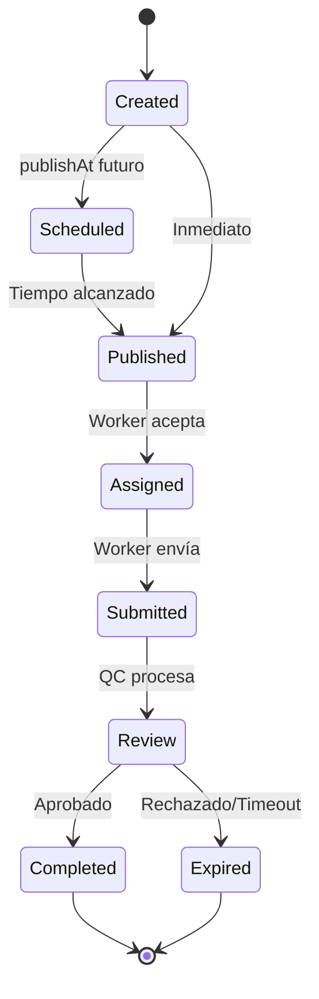

| Estado | Descripción |
|--------|-------------|
| `Created` | Tarea recién creada |
| `Scheduled` | Esperando fecha de publicación |
| `Published` | Disponible para workers |
| `Assigned` | Asignada a un worker |
| `Submitted` | Trabajo enviado |
| `Review` | En control de calidad |
| `Completed` | Tarea completada |
| `Expired` | Tarea expirada o rechazada |

---

### Estados de Submissions (`SubmissionStatus`)

| Estado | Descripción |
|--------|-------------|
| `Pending` | Esperando revisión |
| `PendingConsensus` | Esperando quorum para votación |
| `Approved` | Aprobado (trigger de pago) |
| `Rejected` | Rechazado |
| `Disputed` | En disputa |
| `RejectedFinal` | Rechazado definitivamente |

---

### Niveles de Workers (`WorkerLevel`)

| Nivel | Requisitos |
|-------|------------|
| `Novice` | Nuevo worker (default) |
| `Intermediate` | ≥10 tareas, accuracy ≥70% |
| `Expert` | ≥50 tareas, accuracy ≥90% |

---

### Tipos de Transacciones (`TransactionType`)

| Tipo | Descripción |
|------|-------------|
| `DEPOSIT` | Depósito de fondos |
| `WITHDRAWAL` | Retiro de fondos |
| `TASK_PAYMENT` | Pago por tarea completada |
| `PLATFORM_FEE` | Comisión de la plataforma |
| `REFUND` | Reembolso |

---

### Certificaciones de Workers

| Certificación | Descripción |
|--------------|-------------|
| `image-labeling` | Etiquetado de imágenes |
| `audio-transcription` | Transcripción de audio |
| `sentiment-analysis` | Análisis de sentimiento |
| `data-validation` | Validación de datos |
| `bounding-box` | Dibujo de bounding boxes |

---

## API Endpoints

### Endpoints de Tareas

| Método | Endpoint | Handler | Descripción |
|--------|----------|---------|-------------|
| `POST` | `/tasks` | `create-task.ts` | Crear nueva tarea |
| `GET` | `/tasks` | `list-tasks.ts` | Listar tareas disponibles |
| `GET` | `/tasks/my-published` | `list-my-published.ts` | Mis tareas publicadas (Requester) |
| `GET` | `/tasks/my-tasks` | `list-my-tasks.ts` | Mis tareas asignadas (Worker) |
| `POST` | `/tasks/assign` | `assign-task.ts` | Asignar tarea a worker |
| `DELETE` | `/tasks/{taskId}` | `delete-task.ts` | Eliminar tarea |

---

### Endpoints de Submissions

| Método | Endpoint | Handler | Descripción |
|--------|----------|---------|-------------|
| `POST` | `/submissions` | `submit-work.ts` | Enviar trabajo completado |

---

### Endpoints de Media

| Método | Endpoint | Handler | Descripción |
|--------|----------|---------|-------------|
| `POST` | `/media/upload` | `upload-media.ts` | Obtener URL pre-firmada para upload |

---

### Endpoints de Wallet

| Método | Endpoint | Handler | Descripción |
|--------|----------|---------|-------------|
| `GET` | `/wallet` | `get_wallet.py` | Obtener balance |
| `POST` | `/wallet/deposit` | `deposit_funds.py` | Depositar fondos |
| `POST` | `/wallet/withdraw` | `withdraw_funds.py` | Retirar fondos |

---

### Endpoints de Disputas

| Método | Endpoint | Handler | Descripción |
|--------|----------|---------|-------------|
| `POST` | `/disputes` | `start_dispute.py` | Iniciar disputa |
| `POST` | `/disputes/resolve` | `admin_review.py` | Resolver disputa (Admin) |

---

## Servicios AWS Utilizados

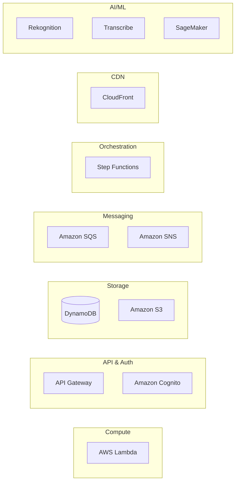

### Detalle de Servicios

| Servicio | Uso en el Proyecto |
|----------|-------------------|
| **Lambda** | Funciones serverless (TypeScript + Python) |
| **API Gateway** | REST API con autorización Cognito |
| **Cognito** | Autenticación de usuarios (Requester/Worker/Admin) |
| **DynamoDB** | Base de datos NoSQL (7 tablas) |
| **S3** | Almacenamiento de media (imágenes, audio) y frontend |
| **SQS** | Colas para procesamiento async de submissions |
| **SNS** | Notificaciones a admins para disputas |
| **Step Functions** | Orquestación de flujo de disputas |
| **CloudFront** | CDN para el frontend React |
| **Rekognition** | Validación automática de clasificación de imágenes |
| **Transcribe** | Transcripción automática de audio (referencia) |
| **SageMaker** | Modelos ML personalizados (opcional) |

---

## Frontend (React + TypeScript)

### Stack Tecnológico

- **Framework:** React 18
- **Lenguaje:** TypeScript
- **Build Tool:** Vite
- **Routing:** React Router DOM
- **Auth:** AWS Amplify
- **Estilos:** CSS vanilla

### Páginas Principales

| Ruta | Componente | Rol | Descripción |
|------|------------|-----|-------------|
| `/` | `App.tsx` | Todos | Landing con selección de rol |
| `/requester` | `RequesterApp.tsx` | Requester | Dashboard de requester |
| `/requester/dashboard` | `RequesterDashboard.tsx` | Requester | Crear tareas, métricas |
| `/requester/my-tasks` | `RequesterMyTasks.tsx` | Requester | Gestionar tareas publicadas |
| `/worker` | `WorkerApp.tsx` | Worker | Dashboard de worker |
| `/worker/dashboard` | `WorkerDashboard.tsx` | Worker | Tareas disponibles |
| `/worker/my-tasks` | `WorkerMyTasks.tsx` | Worker | Tareas asignadas |
| `/admin` | `AdminDashboard.tsx` | Admin | Disputas y analytics |

### Componentes Reutilizables

| Componente | Descripción |
|------------|-------------|
| `BoundingBoxEditor.tsx` | Canvas interactivo para dibujar rectángulos en imágenes |
| `DashboardMetrics.tsx` | Visualización de métricas (budget, earnings, quality) |
| `TaskMedia.tsx` | Renderizado de media (imagen, audio, video) con zoom |

---

## Backend (Lambda Handlers)

### Handlers TypeScript (`backend/src/tasks/`)

| Handler | Descripción |
|---------|-------------|
| `create-task.ts` | Crea nueva tarea en DynamoDB |
| `list-tasks.ts` | Lista tareas con status "Published" |
| `list-my-published.ts` | Lista tareas del requester autenticado |
| `list-my-tasks.ts` | Lista tareas asignadas al worker |
| `assign-task.ts` | Asigna tarea a worker |
| `delete-task.ts` | Elimina tarea (validando ownership) |

### Handlers Python (`backend/src/handlers/`)

#### Disputas (`disputes/`)
| Handler | Descripción |
|---------|-------------|
| `start_dispute.py` | Inicia disputa y ejecuta Step Function |
| `admin_review.py` | Resolución manual de disputas |
| `auto_resolve.py` | Auto-aprobación tras timeout (3 días) |
| `update_status.py` | Actualiza estado de disputa |

#### Pagos (`payments/`)
| Handler | Descripción |
|---------|-------------|
| `process_payment.py` | Trigger de DynamoDB Streams para pagos automáticos |

#### Control de Calidad (`qc/`)
| Handler | Descripción |
|---------|-------------|
| `validate_submission.py` | Validación con AI (Rekognition, Transcribe) |
| `consensus_check.py` | Votación por consenso (majority voting) |

#### Submissions (`submissions/`)
| Handler | Descripción |
|---------|-------------|
| `create_submission.py` | Procesa nuevo submission |

#### Tasks (`tasks/`)
| Handler | Descripción |
|---------|-------------|
| `list_available_tasks.py` | Lista tareas filtradas por nivel del worker |
| `create_task_batch.py` | Crea lotes de tareas |
| `process_transcription.py` | Procesa resultado de Transcribe |

#### Wallet (`wallet/`)
| Handler | Descripción |
|---------|-------------|
| `deposit_funds.py` | Deposita fondos en wallet |
| `withdraw_funds.py` | Retira fondos (mock PayPal) |
| `get_wallet.py` | Obtiene balance actual |

#### Workers (`workers/`)
| Handler | Descripción |
|---------|-------------|
| `update_worker_stats.py` | Actualiza estadísticas y nivel |

---

## Flujos de Trabajo

### 1. Flujo de Creación de Tarea

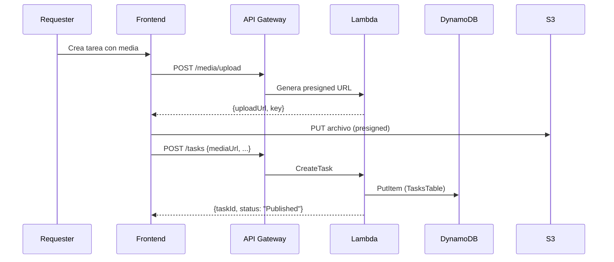

---

### 2. Flujo de Trabajo del Worker

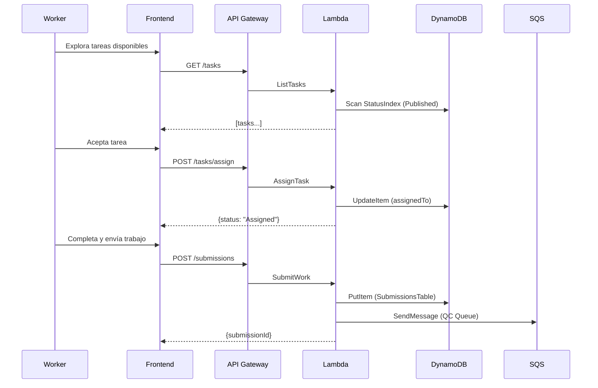

---

### 3. Flujo de Control de Calidad (QC)

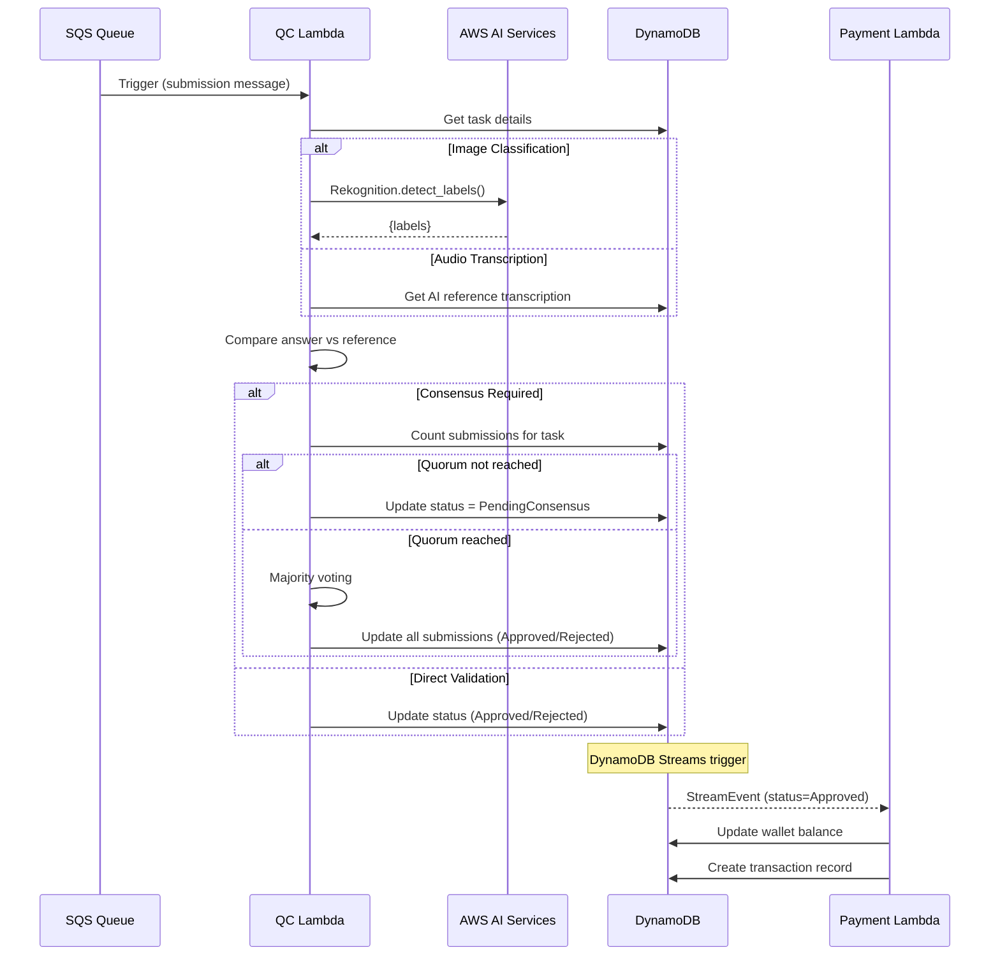

---

### 4. Flujo de Disputa

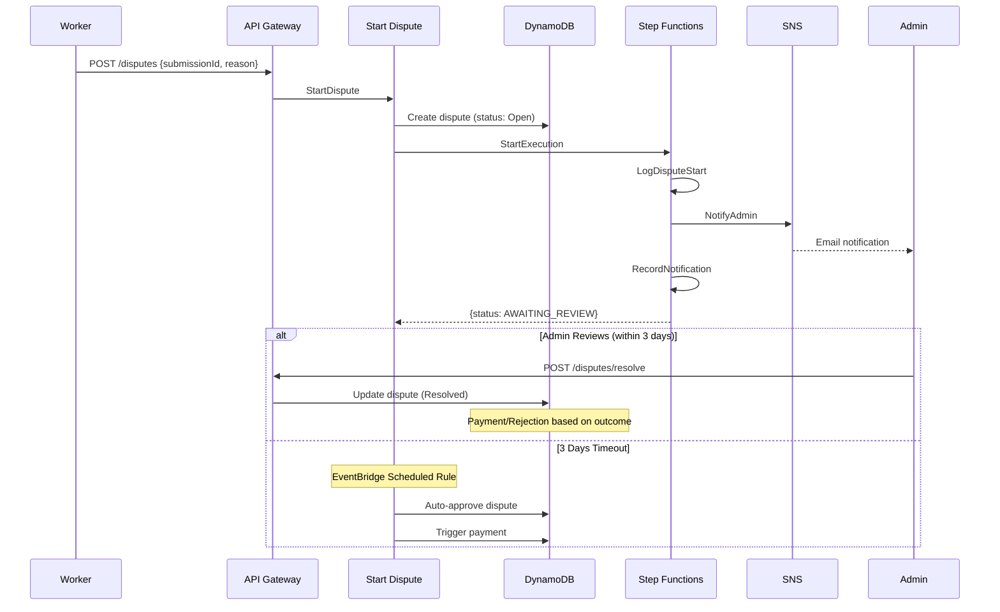

---

## Sistema de Gamificación

### Cálculo de Nivel

```python
def calculate_level(tasks_submitted, accuracy):
    if tasks_submitted >= 50 and accuracy >= 0.90:
        return "Expert"
    elif tasks_submitted >= 10 and accuracy >= 0.70:
        return "Intermediate"
    else:
        return "Novice"
```

### Beneficios por Nivel

| Nivel | Acceso a Tareas | Prioridad |
|-------|----------------|-----------|
| `Novice` | Solo tareas básicas | Normal |
| `Intermediate` | Tareas intermedias | Alta |
| `Expert` | Todas las tareas (incluyendo premium) | Máxima |

### Métricas Rastreadas

- **tasksSubmitted:** Total de tareas enviadas
- **tasksApproved:** Tareas aprobadas exitosamente
- **accuracy:** `tasksApproved / tasksSubmitted`
- **certifications:** Lista de certificaciones obtenidas

---

## Sistema de Control de Calidad (QC)

### Métodos de Validación

#### 1. Amazon Rekognition (Image Classification)
```python
# Detecta etiquetas en la imagen
response = rekognition.detect_labels(
    Image={'S3Object': {'Bucket': bucket, 'Name': key}},
    MinConfidence=90
)
# Compara con la respuesta del worker
```

#### 2. Amazon Transcribe (Audio Transcription)
```python
# Inicia transcripción al crear tarea
transcribe.start_transcription_job(...)
# Almacena referencia en DynamoDB
# Compara usando similitud de texto (≥85%)
```

#### 3. Consensus Voting (Majority Voting)
```python
CONSENSUS_QUORUM = 3  # Submissions requeridos

# Si hay 3 respuestas: A, A, B
# Consenso = A (2/3 mayoría)
# Workers con A = Approved, Worker con B = Rejected
```

---

## Sistema de Pagos

### Flujo Automático

1. **Trigger:** DynamoDB Streams detecta cambio `status = "Approved"`
2. **Process Payment Lambda:**
   - Obtiene detalles del task y submission
   - Calcula: `worker_payment = reward - platform_fee`
   - Actualiza WalletTable del worker
   - Crea TransactionRecord
3. **Actualización de Stats:** Incrementa `tasksApproved` del worker

### Tipos de Transacciones

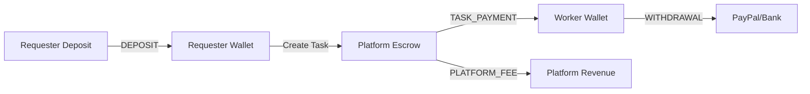

---

## Sistema de Disputas

### Estados de Disputa

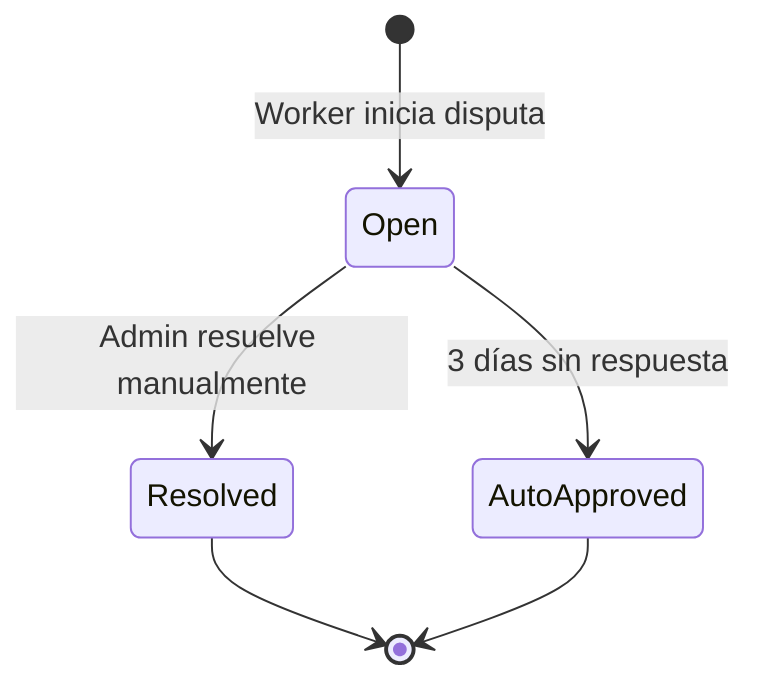

### Timeout Automático

- **Duración:** 3 días (72 horas)
- **Implementación:** EventBridge Scheduler
- **Resultado:** Auto-aprobación a favor del worker

---

## Relaciones entre Entidades

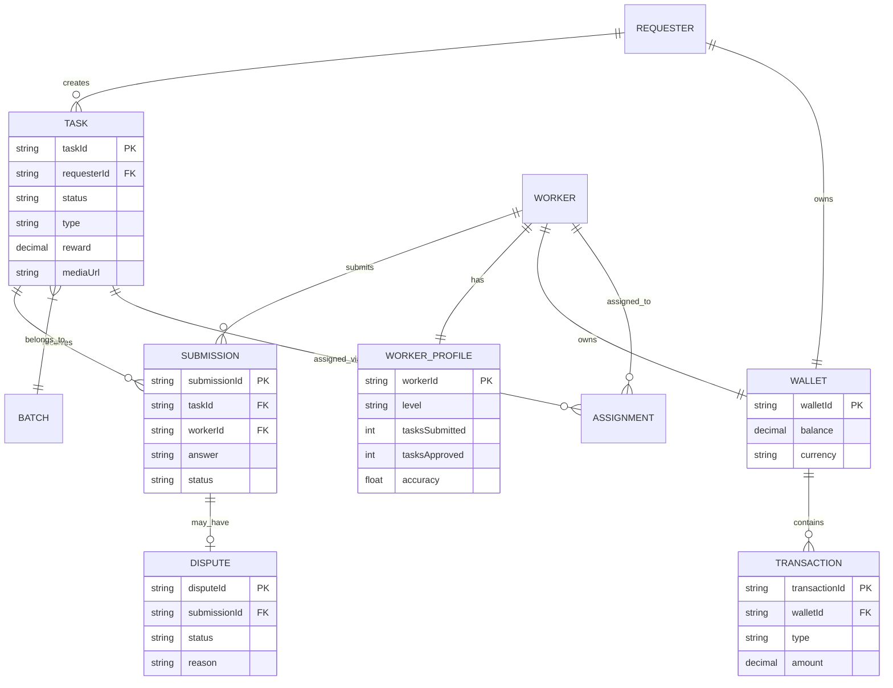

---

## Diagramas de Flujo

### Ciclo de Vida Completo de una Tarea

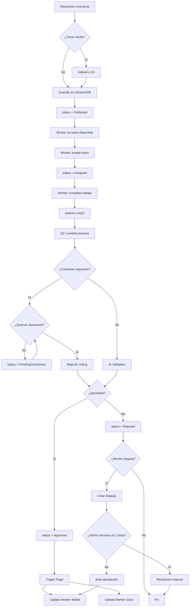

---

## Configuración y Variables de Entorno

### Backend (`config.py`)

```python
class Config:
    # AWS Region
    AWS_REGION = 'us-east-1'
    
    # DynamoDB Tables
    TASKS_TABLE = ''           # TasksTable
    SUBMISSIONS_TABLE = ''     # SubmissionsTable
    WALLETS_TABLE = ''         # WalletTable
    TRANSACTIONS_TABLE = ''    # TransactionsTable
    DISPUTES_TABLE = ''        # DisputesTable
    ASSIGNMENTS_TABLE = ''     # AssignmentsTable
    WORKERS_TABLE = ''         # WorkersTable
    
    # SQS Queues
    SUBMISSION_QUEUE_URL = ''
    AVAILABLE_TASKS_QUEUE_URL = ''
    
    # Step Functions
    DISPUTE_STATE_MACHINE_ARN = ''
    
    # S3 Buckets
    MEDIA_BUCKET = ''
    
    # AI Services
    SAGEMAKER_ENDPOINT_NAME = ''
    REKOGNITION_MIN_CONFIDENCE = 90
    TRANSCRIBE_LANGUAGE = 'es-ES'
    TEXT_SIMILARITY_THRESHOLD = 0.85
    
    # Consensus
    CONSENSUS_QUORUM = 3  # Submissions requeridos para votación
```

### Frontend (`aws-config.ts`)

```typescript
export const authConfig = {
  Cognito: {
    userPoolId: 'YOUR_USER_POOL_ID',
    userPoolClientId: 'YOUR_CLIENT_ID',
  }
};

export const apiConfig = {
  endpoint: 'YOUR_API_GATEWAY_URL'
};
```

---

## 🚀 Comandos de Despliegue

```bash
# 1. Bootstrap CDK (solo primera vez)
cd infrastructure
npx cdk bootstrap

# 2. Desplegar toda la infraestructura
npx cdk deploy --all

# 3. Construir y desplegar frontend
cd ../frontend
npm install
npm run build
aws s3 sync dist s3://YOUR-BUCKET-NAME --delete
aws cloudfront create-invalidation --distribution-id YOUR-DIST-ID --paths "/*"
```

---

## 📌 Notas Importantes

> [!IMPORTANT]
> Las tablas DynamoDB están configuradas con `RemovalPolicy.DESTROY` para desarrollo. Cambiar a `RETAIN` para producción.

> [!WARNING]
> Los endpoints de wallet (`deposit`, `withdraw`) son **mock** y no integran pasarelas de pago reales.

> [!NOTE]
> El sistema de consenso requiere `CONSENSUS_QUORUM = 3` submissions antes de validar automáticamente.

---

*Documentación generada para el proyecto AWS Microtasks Platform*
